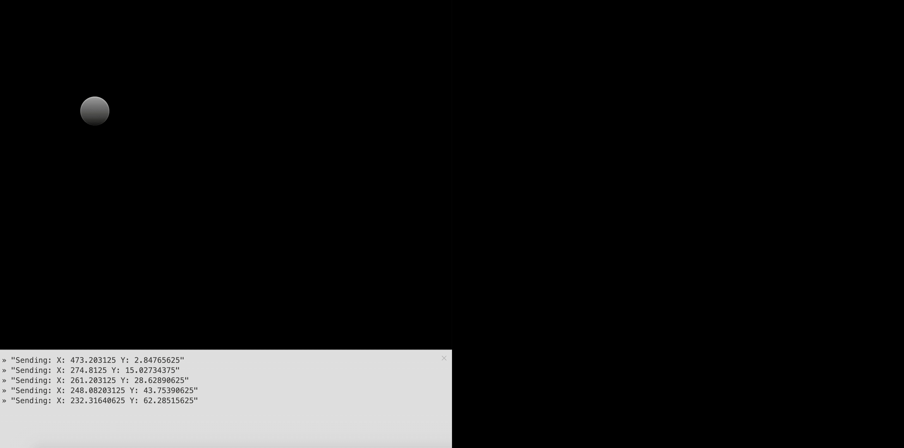
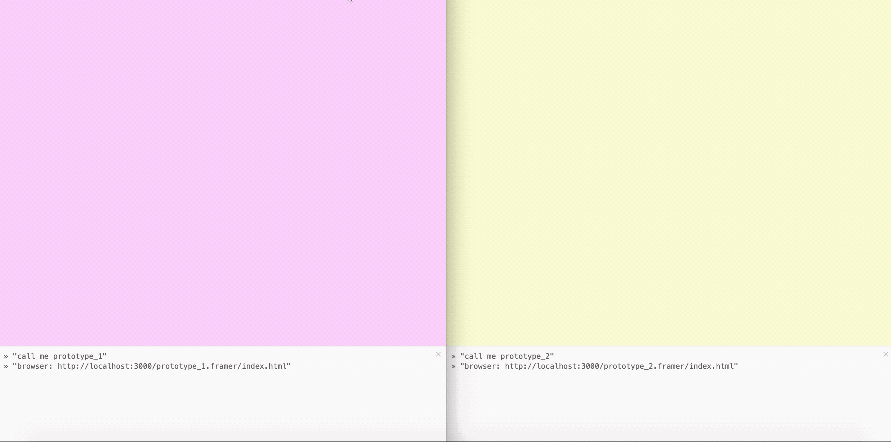

# Framer-Prototyping-for-Cross-Device-Interactions
Quick step-by-step tutorial for prototyping cross-device Experiences in Framer

This is an example of server-side programming with Framer for realtime communication between multiple prototypes.


**[→ Tutorial](http://medium.com)**


It requires *Node*, *Socket.io* and *Express* 

Run! →  ```node server.js```

## Example – first Framer Prototype

 

## Example – second Framer Prototype


